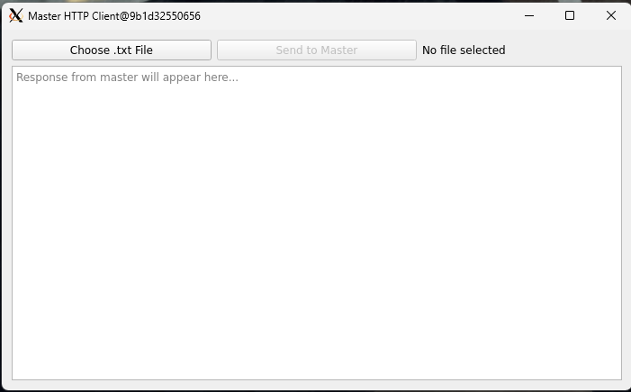
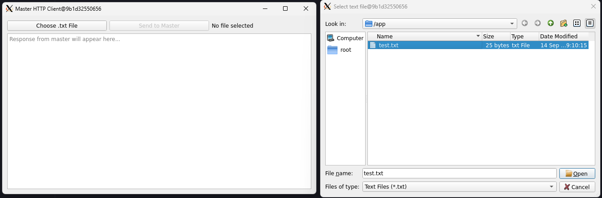
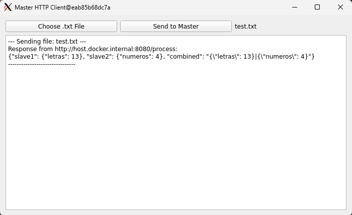
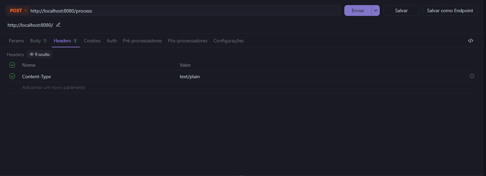
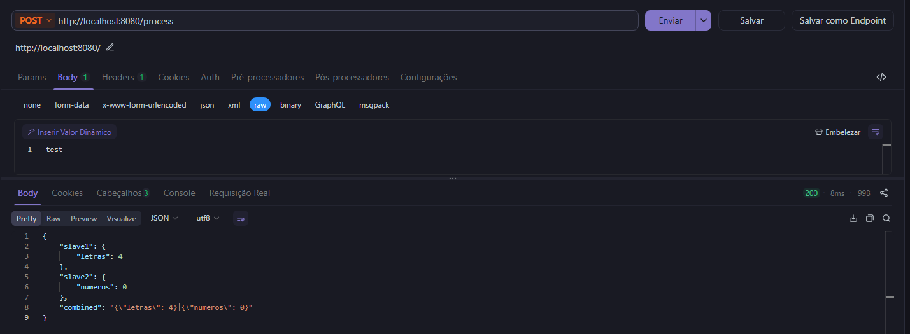

# Sistema mestre-escravo (C++17, Docker)

Este repositório contém uma implementação simples em C++ de um serviço Mestre que recebe requisições do Cliente e distribui trabalho para dois Escravos (`slave1`, `slave2`). A comunicação é feita por HTTP REST usando a biblioteca single-header `cpp-httplib`.

Estrutura
- `server/` - código do Mestre
- `slave1/`, `slave2/` - código dos Escravos
- `client/` - exemplo de cliente (CLI)
- `docker-compose.yml` - orquestra os serviços

Pré-requisitos
- Docker e Docker Compose


Subir com Docker (recomendado)

### Opção 1: Script Automático (Windows) - Mais Fácil

Para usuários Windows, existe um script que automatiza todo o processo:

```powershell
# Executa Docker + VcXsrv + Todos os serviços automaticamente
.\run_all.bat
```

O script `run_all.bat` faz automaticamente:
- ✅ Verifica se Docker está rodando e tenta iniciar se necessário
- ✅ Inicia VcXsrv (se `start_vcxsrv.bat` existir)
- ✅ Sobe master e slaves com `docker-compose up --build -d`
- ✅ Rebuilda e executa o container do cliente
- ✅ Mostra logs e status dos containers

### Opção 2: Manual (Windows/Linux/macOS)

1. Build e iniciar os serviços:

```bash
docker-compose up --build
```

2. Testar o endpoint do Mestre (do host):

```bash
curl -X POST http://localhost:8080/process -d 'hello'
```

### Monitoramento

Verifique se todos os containers estão rodando:
```bash
docker ps
```

Veja logs dos serviços:
```bash
docker logs -f master
docker logs -f slave1
docker logs -f slave2
docker logs -f client
```

### Exemplo de Teste Manual

```bash
# Teste básico via curl
curl -X POST http://localhost:8080/process -d 'texto de exemplo'

# Teste com arquivo
curl -X POST http://localhost:8080/process --data-binary @meuarquivo.txt
```

## Cliente CLI (alternativo)

Também há um cliente CLI em `client/` para uso em linha de comando:

```powershell
cd client;
docker build -t client_cli .;
docker run --rm -v "${PWD}:/data" client_cli /data/meuarquivo.txt http://host.docker.internal:8080
```


Usando interface gráfica no Windows (VcXsrv)

Se você precisa executar aplicações gráficas dentro de containers e visualizar no Windows, uma opção simples é usar o VcXsrv (X server para Windows).

- Link: https://sourceforge.net/projects/vcxsrv/

Passos rápidos (Windows + Docker Desktop)

1. Baixe e instale o VcXsrv.
2. Execute o XLaunch e escolha "Multiple windows" (ou outra opção que preferir). Use Display number 0. Para desenvolvimento local, marcar "Disable access control" simplifica a configuração (atenção: reduz segurança).
3. Permita o VcXsrv no Firewall do Windows se solicitado.

Configurar containers para usar o X server

Opção A — Docker Desktop (Windows):

Defina a variável de ambiente `DISPLAY` como `host.docker.internal:0.0`. Exemplo genérico:

```powershell
docker run --rm -e DISPLAY=host.docker.internal:0.0 -v "${PWD}:/work" my-gui-image
```

No WSL2, exporte o DISPLAY para o IP do Windows host:

```bash
export DISPLAY=$(grep nameserver /etc/resolv.conf | awk '{print $2}'):0.0
```

Dicas e problemas comuns
- Se `host.docker.internal` não for resolvido, adicione `--add-host=host.docker.internal:host-gateway` ao `docker run` (Docker 20.10+).
- Se a janela não abrir, verifique o Firewall do Windows e as configurações do VcXsrv.
- Para desenvolvimento local, desabilitar o controle de acesso do X server é prático, mas não seguro para ambientes públicos.

## Interface do Cliente

O sistema inclui uma interface gráfica para o cliente, desenvolvida em Qt, que facilita a interação com o sistema distribuído.

### Tela Principal do Cliente



A interface permite ao usuário selecionar arquivos e enviar requisições ao servidor mestre de forma intuitiva.

### Seleção de Arquivo



O cliente oferece um seletor de arquivos que permite escolher arquivos de texto (.txt) para processamento pelos escravos.

### Recebimento de Resposta



Após o processamento, o cliente exibe a resposta recebida do sistema mestre-escravo, mostrando os resultados do processamento distribuído.

## Teste via Requisições JSON

Para testes e desenvolvimento, você pode enviar requisições HTTP diretamente ao servidor usando ferramentas como curl, Postman, ou qualquer cliente HTTP.

### Cabeçalhos da Requisição



Configure os cabeçalhos apropriados para enviar dados ao endpoint `/process` do servidor mestre.

### Resposta JSON do Sistema



O sistema retorna respostas em formato JSON contendo os resultados do processamento distribuído realizado pelos escravos.

## Observações do projeto
- Implementação didática: JSON construído manualmente e tratamento de erros simples.
- Para produção, recomenda-se usar `nlohmann/json` e políticas de retry/timeout mais robustas.
- As imagens de demonstração mostram o funcionamento real da interface do cliente e exemplos de teste.

## Links úteis:
- Docker Desktop: https://www.docker.com/products/docker-desktop
- VcXsrv X Server: https://sourceforge.net/projects/vcxsrv/
- cpp-httplib: https://github.com/yhirose/cpp-httplib

---
Projeto para fins educacionais/demonstração.